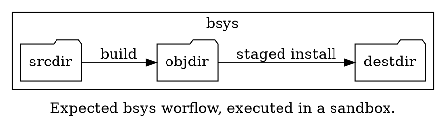
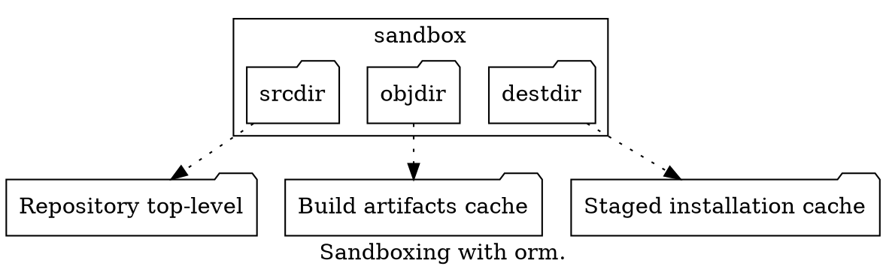
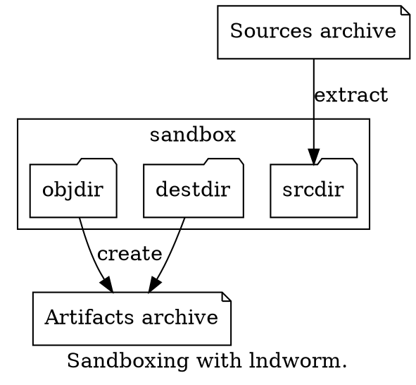
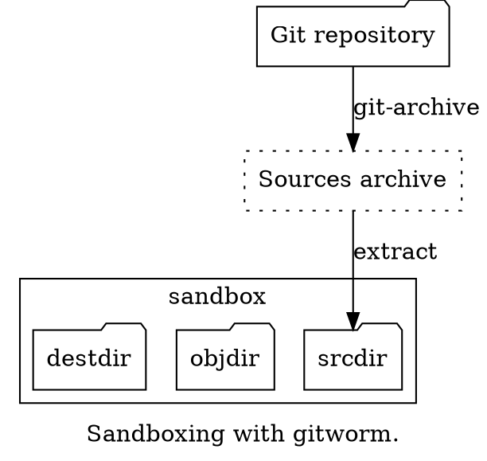

# Introduction

## Sandbox workflow

Jormungandr is designed to work with a specific workflow.
This workflow, described by a **bsys** executable,
is executed inside a **sandbox**, which is a container
based on a **toolchain** directory tree.

The build sequence is expected to be "out of source tree". It means
generated build artifacts should not be created inside the **srcdir**
source directory tree. The generated build artifacts are expected
to be created inside the **objdir** directory. In most cases, the **srcdir**
is a read-only directory while **objdir** can always be written.
Meaning this policy is enforced by the **sandbox** itself.

As the workflow inside a **sandbox** is mostly always the same,
and the workflow is described by a **bsys** executable, it usually means
that **bsys** executables should be reusable accross jormungandr's tools.
Thus, the tryptic **toolchain**, **bsys**, **srcdir**
(and the optional command line arguments forwarded to the **bsys**)
describes a reproducible build sequence inside a sandbox.

The workflow can be augmented by specifying a **sysroot**. The **sysroot**
is expected to be the target system root directory and is meant for cross-compilation
workflows. It is the responsibility of the **bsys** to rely, or not, on the **sysroot**.
While jormungandr can enforce a read-only **sysroot**, its final meaning is left to the user.

## Host workflow

The **sandbox** workflow doesn't usually vary, allowing reproducibility.
The reasons why said workflow was invoked from the host can be numerous,
that's why jormungandr is first and foremost a collection of tools.

While every tool is unique, they all share common arguments and default behaviours.
The default **bsys** and **toolchain** have the value `default` if none is provided
either through the use of the `ORM_DEFAULT_TOOLCHAIN`/`ORM_DEFAULT_BSYS` environment
variables or if none of these arguments are explicitly set through command line arguments.

The **bsys** being an executable file (such as a shell script)
its directory gets mounted read-only in the **sandbox**.
This way the **bsys** can be used with auxiliary data, such as
configuration files or can even include modules if it is based
on an advanced scripting language (Ruby, Python, etc...).

The host locations of the **bsys** and the **toolchain** depend on their values.
If they do not contain a `/`, they are inferred from the global configuration,
which is located in either user data or system data directories under
`$XDG_DATA_DIRS/jormungandr`. Refer to the [XDG Base Directory Specification](https://specifications.freedesktop.org/basedir-spec/latest/)
for more informations. If their values contain a `/`, they are paths,
relative to the tool's current working directory when it was invoked.

### Interative builds for development

During development, artifacts are usually built and iterated
upon, depending on a build system such as `make` or `ninja` to
avoid a complete rebuild of the whole project every time.

The `orm` tool addresses this use case, integrating by default with the `git`
[Source Code Management (SCM)](https://en.wikipedia.org/wiki/Version_control) suite.

By executing `orm` inside your `git` repository, it will infer the source's toplevel
directory through the use of, by default, the `git rev-parse --show-toplevel` command.
For more informations, see the related manual page for `orm(1)`.

### Source release archive builds for distributions

When building open-source projects, releases are shipped as source tarballs.
Building these archives usually require extracting them, creating a temporary
build directory and performing the build instructions.

The `lndworm` tool is meant to easily automate these tasks. In its context,
the **bsys** describes the build and (staged) installation instructions.
It then generates either the **objdir** or the **destdir** directory.
For more informations, see the related manual page for `lndworm(1)`.

### Continuous integration builds with git

As a sandbox workflow should be reproducible, automated testing
should not require generating artifacts, only produce logs and an
exit code (0 for success, else failure).

The `gitworm` tool was designed to be used as a git hook (cf. `githooks(5)`),
and uses a git reference, potentially from a non-working copy of the repository (a bare repository).
It then executes the given **bsys** in a transient environment where no artifacts
are kept, and the source code was extracted from the repository using `git-archive(1)`.

