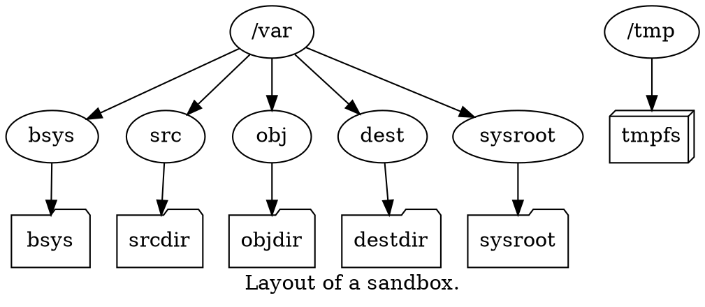

# Toolchains requirements

A **toolchain** is a minimal system directory hierarchy
which can be used inside a jormungandr **sandbox**.

The common Linux system's `/dev`, `/proc` and `/sys` directories
are exported from the host to the **sandbox**, allowing accesses to devices.
The **toolchain** must provide a set of directories and files:
- `/etc/passwd`: The users files, users `0` (`root`) and `1000` are required.
- `/etc/group`: The groups files, groups `0` (`root`) and `1000` are required.
- `/tmp`: A directory, where a `tmpfs` is mounted.
- `/usr/bin` and `/usr/sbin`: Directories where binary executables are located.
- `/var/bsys`: A directory, where the **bsys** is mounted read-only.
- `/var/sysroot`: A directory, where the **sysroot** is mounted.
- `/var/src`: A directory, where the **srcdir** is mounted.
- `/var/obj`: A directory, where the **objdir** is mounted.
- `/var/dest`: A directory, where the **destdir** is mounted.

